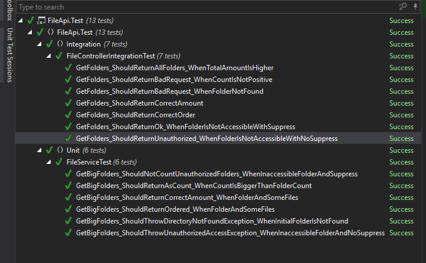
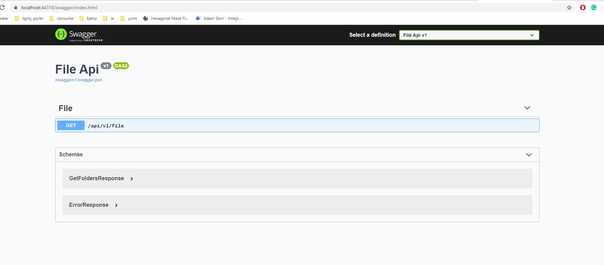
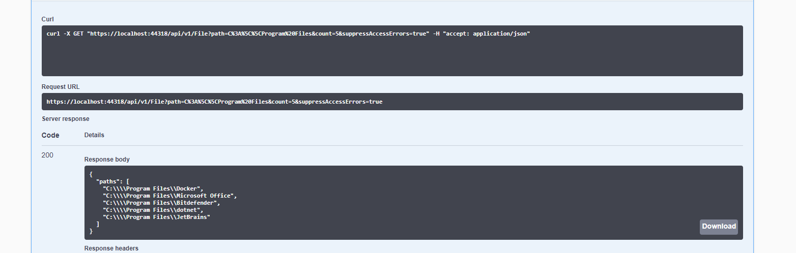
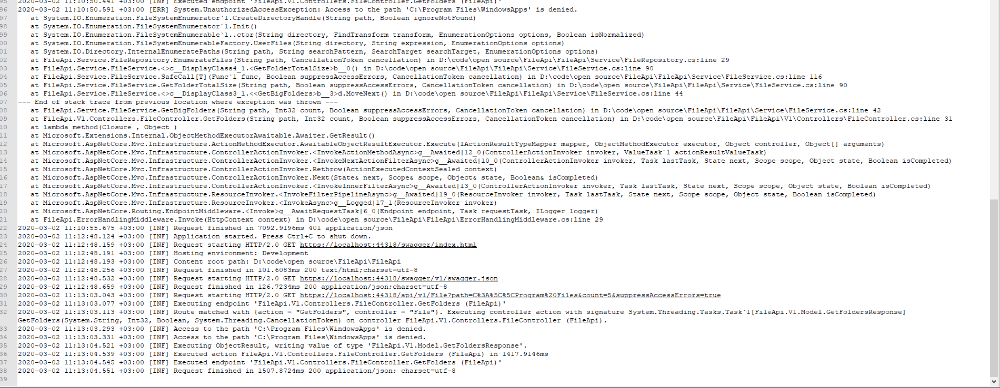

# FileApi
File traverse api build with .net core 3.1 with swagger, unit tests and integration tests. Api documentation can be found under swagger.

# Unit tests
Unit tests has no external dependency and can be run independently.

# Integration tests
Integration tests creates a fake host to run using .net core libraries. Internal file dependency is faked so it can be run independently.

# Test Results

# Swagger
When the project boots up, swagger shows up immediately with all api information. swagger is also configured for versioning.

# A Sample Result from Swagger

# Logging
Events are logged to a file using serilog. Log's are generated at the root level under *Log/* folder for each day seperately.

